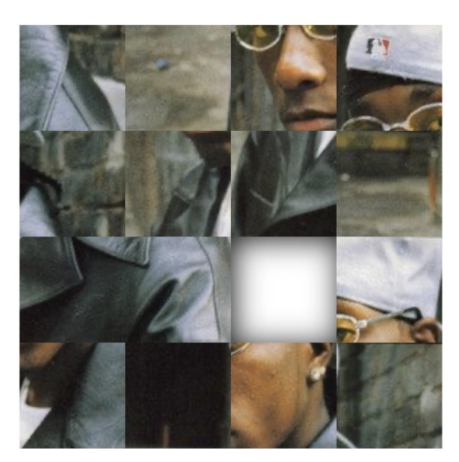

# react-native-picture-puzzle
⚛️ 🧩  A picture puzzle component. Supports [**Android**](https://reactnative.dev), [**iOS**](https://reactnative.dev) and the [**Web**](https://github.com/necolas/react-native-web).

<p align="center">
  </img>
</p>


## 🚀 getting started

Using [**Yarn**](https://yarnpkg.com):

```sh
yarn add react-native-picture-puzzle
```

## ✍️ usage

```typescript
import React from 'react';
import { PicturePuzzle, PuzzlePieces } from 'react-native-picture-puzzle';

export default function App() {
  const [hidden, setHidden] = React.useState<number | null>(0); // piece to obscure
  const [pieces, setPieces] = React.useState<PuzzlePieces>([0, 1, 2, 3, 4, 5, 6, 7, 8]);
  const source = React.useMemo(() => ({
    uri: 'https://pbs.twimg.com/profile_images/1180062941162479616/W8XdhKTG_400x400.jpg',
  }), []);
  const renderLoading = React.useCallback((): JSX.Element => <ActivityIndicator />, []);
  const onChange = React.useCallback((nextPieces: PuzzlePieces, nextHidden: number | null): void => {
    setPieces([...nextPieces]);
    setHidden(nextHidden);
  }, [setPieces, setHidden]);
  return (
    <PicturePuzzle
      size={500}
      pieces={pieces}
      hidden={hidden}
      onChange={onChange}
      source={source}
      renderLoading={renderLoading}
    />
  );
}
```

## 🦄 types

```typescript
export type PuzzlePiece = number;

export type PuzzlePieces = readonly PuzzlePiece[];

export enum MoveDirection {
  BOTTOM = 'bottom',
  LEFT = 'left',
  RIGHT = 'right',
  TOP = 'top',
}

export type PicturePuzzleProps = ImageProps & {
  readonly hidden: number | null;
  readonly size: number;
  readonly pieces: PuzzlePieces;
  readonly source: ImageURISource | number;
  readonly renderLoading?: () => JSX.Element;
  readonly onChange?: (nextPieces: PuzzlePieces, nextHidden: number | null) => void;
};
```

## ✌️ license
[**MIT**](./LICENSE)
